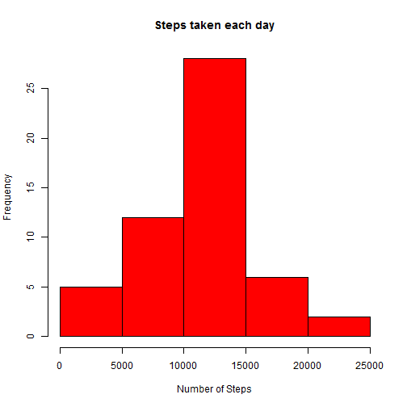
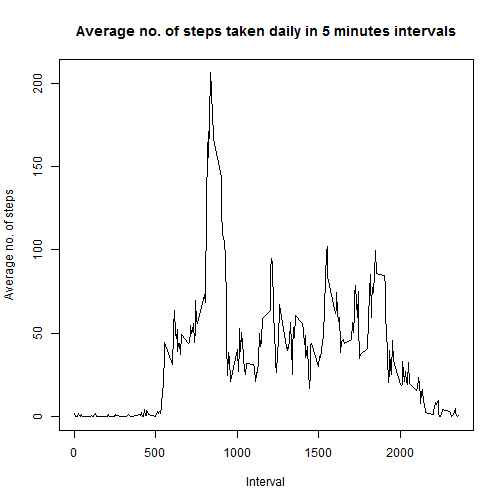
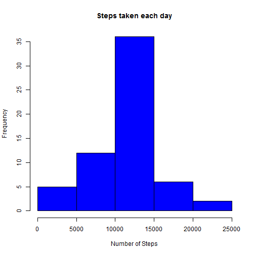

# Reproducible Research: Peer Assessment 1


## Loading and preprocessing the data

Here, for convenience, we assume that the input-file is located in the same file-directory from where this Rmarkup file is being run.

```r
opts_chunk$set(echo = TRUE)
f <- read.csv("activity.csv")
g <- aggregate(f$steps, list(f$date), sum, na.rm=FALSE)
colnames(g) <- c("day", "steps")
```

## What is mean total number of steps taken per day?

### a. Histogram of the total number of steps taken each day :-


```r
hist(g$steps, col = "RED", main = "Steps taken each day", xlab = "Number of Steps")
```

 

```r
mn <- mean(g$steps, na.rm=TRUE)
md <- median(g$steps, na.rm=TRUE)
```

### b. The mean and median (when calculated ignoring rows with missing-number) of total number of steps taken each day are 1.0766 &times; 10<sup>4</sup> and 10765, respectively.

## What is the average daily activity pattern?


```r
a <- aggregate(f$steps, list(f$interval), mean, na.rm=TRUE)
colnames(a) <- c("interval", "steps")
plot(a$interval, a$steps, type = "l", xlab = "Interval", ylab = "Average no. of steps", main = "Average no. of steps taken daily in 5 minutes intervals")
```

 

```r
maxavg <- a[a$steps == max(a$steps),"interval"]
```

### The 835 -th 5-minute interval, on average across all the days in the dataset, contains the maximum number of steps.


## Imputing missing values


```r
x <- nrow(f)
y <- nrow(f[!is.na(f$steps),])
```

### 1. There are total (x - y) = 2304 rows in the dataset with missing values (i.e. the total number of rows with NAs).
### 2. The strategy I take for filling up these NAs, is to use the mean for that 5-minute interval.
### 3. To create a new dataset 'e', similar to the original one, 'f',  with NAs filled up as per the strategy, I first identify the row-numbers, for which the 'steps'-column is NA. Then fill-up the 'steps'-value of those rows, with the 'steps'-value for that 'interval' from the data.frame 'a' (as defined above).  Then we calclate the mean and median of the average number of steps taken each day, and plot a histogram of the same.


```r
e <- f
t <- which(is.na(f$steps))
for (i in 1:length(t)) {
    e[t[i],"steps"] <- a[(a$interval == e[t[i],"interval"]),"steps"]
}

b <- aggregate(e$steps, list(e$date), sum, na.rm=FALSE)
## Keeping na.rm=FALSE here, to keep it syntactically same as 'g'-calculation, though it does not mean anything as 'e' does not contain any NA.

colnames(b) <- c("day_b", "steps_b")

mn_b <- mean(b$steps_b)
md_b <- median(b$steps_b)
hist(b$steps_b, col = "BLUE", main = "Steps taken each day", xlab = "Number of Steps")
```

 

### The mean and median of the new data set are 1.0766 &times; 10<sup>4</sup> and 1.0766 &times; 10<sup>4</sup>, which are same as the estimates from the first part of the assignment.

* Important Note :-  Had we calculated 'g' (day-wise step-count) with 'na.rm=TRUE' option, then mean and medians of g$steps would have been a smaller number.  Because, in that case step-count would have been 0 for 2012-10-01, which then would have been taken for calculating the mean/ median.

## Are there differences in activity patterns between weekdays and weekends?

### I am creating a 'day' factor-variable - with two levels 'weekday' and 'weekend'.  Then attaching it to the dataset with filled-in missing values.  Then through a for-loop, appropriate values are assigned to this variable.


```r
day <- factor(c("weekday","weekend"))
e <- data.frame(day, e)
for (i in 1:nrow(e)) {
    if ((weekdays(as.Date(e[i,"date"])) == "Saturday") | (weekdays(as.Date(e[i,"date"])) == "Sunday")) {
        e[i,"day"] <- "weekend" }
    else {
        e[i,"day"] <- "weekday" } 
    }
```

* The dataset-'p' contains the mean number of steps in the 'interval's during the 'weekday's and 'weekend's.  Then I use the lattice-system (xyplot) to generate the panel plot, as instructed.


```r
library(lattice)
p <- aggregate(e$steps, list(e$day, e$interval),mean)
colnames(p) <- c("day", "interval", "steps")
xyplot(steps ~ interval | day, data = p, type = "l", xlab = "Interval", ylab = "Number of steps", layout = c(1,2))
```

 

### Hence, from the plot we can conclude that in the weekdays the person is more active at the morning hours, than in the weekend. However, in the weekend, s/he is more evenly active during the day than in the weekdays.

